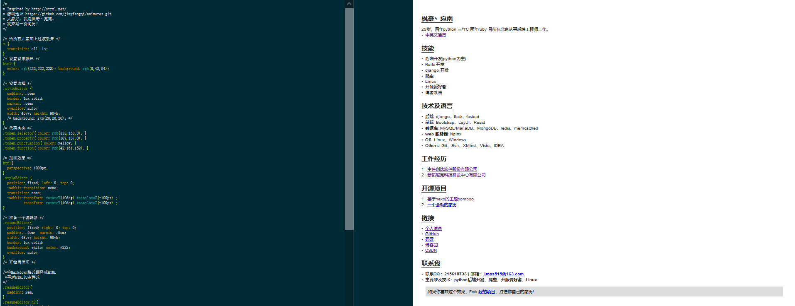

**本项目源于：[https://github.com/jirengu-inc/animating-resume](https://github.com/jirengu-inc/animating-resume "https://github.com/jirengu-inc/animating-resume")。向作者表示深深的敬意。**

# 一个会动的简历模板
- 功能还很少，欢迎各位给我提意见和建议~

## 线上预览

> **This is my resume ➡️ [https://jimyfengqi.github.io/animores/index.html](https://jimyfengqi.github.io/animores/index.html)**

## 项目截图

[](https://jimyfengqi.github.io/animores/index.html "枫奇丶宛南の个人简历")

## 使用方法
```bash
git clone https://github.com/jimyfengqi/animores.git
cd animores
npm install
npm run dev
```

## 部署方法

1. 编辑 **config/index.js**，修改第 10 行的 `assetsPublicPath`，值为 `项目名/public`。如果你没有修改项目名 `animores`，则可跳过此步骤。

2. 编译、上传
```bash
npm run build
git add .
git commit -m "update"
git push
```
3. 开启 **GitHub Pages** 功能，把生成的目标文件`public/*`放在你的web服务器上。

4. 访问地址：[https://your-github-username.github.io/animores/public](https://jimyfengqi.github.io/animores/index.html "https://jimyfengqi.github.io/animores/index.html")

# 关于我
- [个人博客](https://jimyfengqi.github.io/)
- [GitHub](https://github.com/jimyfengqi)
- [码云](https://gitee.com/jimyfengqi)
- [博客园](https://www.cnblogs.com/aifengqi/)
- [CSDN](https://blog.csdn.net/qiqiyingse)
- **主要涉及技术：`python后端开发`、`python爬虫`、`开源爱好者`、`Linux`**

## License

[Apache License](./LICENSE)
